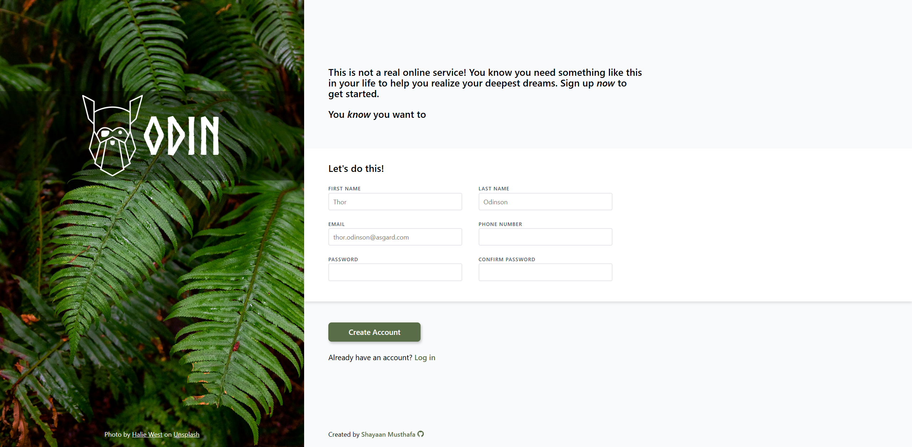

# Odin Portal (Sign-Up Form)

## About

A sleek registration page build as part of [The Odin Project Intermediate HTML and CSS Course](https://www.theodinproject.com/lessons/node-path-intermediate-html-and-css-sign-up-form).

**Odin Portal** is a web-based client registration interface that implements a clean, nature-centric aesthetic balanced against interactive layout design.

*Note that this is not a real online service.*

## Preview

## Technologies Used

- HTML5
- CSS3

## Credits

- **Favicon:** [Odin icon created by Freepik - Flaticon](https://www.flaticon.com/free-icons/odin)

## Contact

Created by [Shayaan Musthafa](https://github.com/shayaan183).